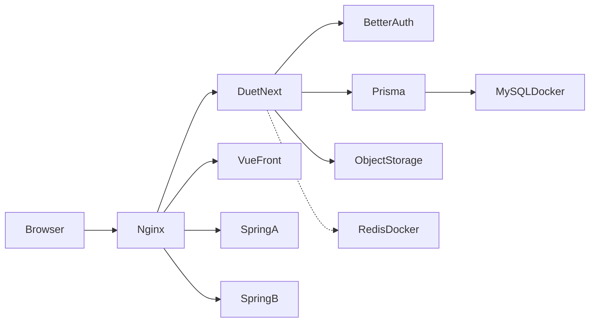

# Duet · 技术栈与工程约定

本文档固定 V1 技术选型与仓库约定，与 [PRODUCT.md](./PRODUCT.md) 对齐。  
实现时以产品文档中的功能 ID（A1–D4）与实体为准；本文只回答「用什么建、怎么放」。

---

## 1. 选型总表

| 层 | 选型 | 说明 |
|----|------|------|
| 语言 | **TypeScript** | 前后端统一，减少契约漂移 |
| 整体形态 | **Next.js 15（App Router）全栈** | 页面、API、服务端逻辑同仓；一人迭代最快 |
| UI | **React 19 + Tailwind CSS** | 自研少量组件，贴 Coastal Dusk；不引入重型组件库 |
| 服务端 | **Server Actions + Route Handlers** | 表单提交、门禁校验走 Server Actions；需要 JSON API 时用 Route Handlers |
| ORM / DB | **Prisma + MySQL 8.0.45** | 复用服务器上已有 MySQL Docker；独立 library / 库名 |
| Auth | **Better Auth**（邮箱 + 密码） | 对应 A1–A2；会话 Cookie；不接第三方登录（V1） |
| 文件存储 | **腾讯云 COS**（S3 兼容 SDK） | 头像、今日配图、日记图；库中只存 URL；未配 COS 时本地 `.data/uploads` 回退 |
| 缓存 | **Redis（可选）** | 服务器已有 Redis Docker；V1 **不强制**（会话走 MySQL）；预留作限流 / 短缓存 |
| 校验 | **Zod** | 表单与 Server Action 入参共用 schema |
| 部署 | **自有服务器 + Docker** | 与现有 Spring Boot / Vue 容器同机；Nginx（或同类）反代 |
| 包管理 | **pnpm** | 锁定依赖，安装更快 |

**不再使用 Vercel 部署应用。** 应用与 MySQL 同机内网互通，不必对公网开放 3306。

---

## 2. 为何这样选

对照 [PRODUCT.md](./PRODUCT.md) 的 V1 边界：

| 产品约束 | 技术对应 |
|----------|----------|
| 仅 Web、移动 + 桌面两套导航 | 单一 Next.js 应用 + 响应式布局；不做原生 App |
| 配对门禁（未配对不能进主应用） | Middleware / 布局层读会话与 `SpaceMember`，未配对重定向创建/加入页 |
| 今日同步、日记、时间线以读多写少为主 | 进入页面拉取；**不做 WebSocket**；可选短轮询或手动刷新 |
| 图文上传（头像方图、今日 1 张、日记 0–9） | 上传 API → 对象存储；MySQL 只存 URL 与元数据 |
| V1 仅浅色 Coastal Dusk | CSS 变量 + Tailwind；不预留深色切换开关 |
| 邮箱密码，不做微信等 | Better Auth email/password；微信小程序登录/绑定与订阅消息见 PRODUCT §3.3.1（V3） |
| 「我们」等 V2 能力 | 数据模型预留扩展位即可，**不写 V2 路由与表** |
| 已有 Docker 基建 | Duet 以容器接入同一套编排；复用 MySQL /（可选）Redis，不另起一套 PaaS |

全栈 Next.js 的取舍：前后端分离（Nest / Hono 等）在双人产品早期收益有限，会多出鉴权、CORS、部署与类型同步成本。V1 优先交付速度与单仓一致性；部署形态对齐现有服务器，而不是再引入 Vercel。

---

## 3. 仓库与目录约定

单仓（非 monorepo），根目录即应用：

```
Duet/
├── PRODUCT.md
├── TECH_STACK.md
├── package.json
├── Dockerfile                 # 生产镜像（standalone）
├── docker-compose.yml         # 或并入服务器现有 compose
├── prisma/
│   ├── schema.prisma
│   └── migrations/
├── public/
├── src/
│   ├── app/                 # App Router：页面与布局
│   │   ├── (auth)/          # 登录 / 注册
│   │   ├── (onboarding)/    # 创建空间 / 加入（配对门禁区）
│   │   ├── (main)/          # 今日 | 记录 | 我的（需已配对）
│   │   ├── api/             # Route Handlers（上传、auth 回调等）
│   │   ├── layout.tsx
│   │   └── globals.css
│   ├── components/          # UI 与业务组件
│   ├── lib/                 # db、auth、storage、日期与邀请码工具
│   ├── server/              # Server Actions、领域服务
│   └── types/               # 共享类型（尽量从 Prisma / Zod 推导）
└── ...
```

约定：

- 路由分组名与信息架构一致：`(main)` 下对应 **今日 / 记录 / 我的**；V1 **不出现**「我们」。
- 领域写操作集中在 `src/server/`，页面只组合 UI 与调用 Action。
- 环境变量：`.env.example` 列出 `DATABASE_URL`、`BETTER_AUTH_*`、对象存储密钥等；密钥不入库。
- Prisma `datasource` 使用 `provider = "mysql"`，连接串指向 MySQL **8.0.45**。
- 生产构建优先 **Next.js `output: "standalone"`**，镜像体积更小、启动更快。

---

## 4. 数据怎么存

| 类型 | 存哪里 | 存什么 |
|------|--------|--------|
| 结构化业务数据 | **MySQL 8.0.45**（Prisma） | User / Space / SpaceMember / CheckIn / Entry 等行数据与关系 |
| 认证会话 | **MySQL**（Better Auth 表） | 账号、密码哈希、Session |
| 图片二进制 | **腾讯云 COS**（或本地 `.data/uploads`） | 头像、今日配图、日记图（0–9）；环境变量见 `.env.example` 的 `COS_*` |
| 图片引用 | **MySQL 字段或 EntryImage** | 对象 key / 公网或签名 URL、可选宽高与顺序 |

原则：**文字与关系进 MySQL；图片进对象存储；库里只挂引用，不存文件二进制。**

MySQL 使用服务器上**已有 Docker 实例**；为 Duet 建**独立 database**（如 `duet`），账号权限与现有 Spring Boot 库隔离，互不踩表。

---

## 5. V1 技术边界

| 做 | 不做（V1） |
|----|------------|
| 页面进入时服务端/客户端拉取最新数据 | WebSocket / SSE 实时推送 |
| 今日页可选短轮询（如 30–60s）或显式刷新 | 推送通知、邮件提醒 |
| 图片上传与裁剪（头像方图） | CDN 图片处理管线（可用存储直链 + 前端裁剪） |
| Cookie 会话鉴权 | JWT 暴露给前端长期存放、第三方登录 |
| Prisma Migrate 管理 schema | 手工改生产库结构 |
| Coastal Dusk 浅色主题变量 | 深色 / 跟随系统 |
| Docker 部署到现有服务器 | Vercel / Cloudflare Workers 跑全栈应用 |

成功标准仍以产品文档为准（约 3 秒内看到对方今日、写今日 ≤ 30 秒）；技术侧保证首屏以服务端数据为主，避免多余客户端瀑布请求。

---

## 6. 与产品实体的映射

| PRODUCT 实体 | 持久化（Prisma 模型方向） | 备注 |
|--------------|---------------------------|------|
| User | `User` + Better Auth 账号/会话表 | 邮箱唯一；密码由 Auth 库管理哈希 |
| Space | `Space` | 邀请码唯一；配对状态可由成员数推导或显式字段 |
| SpaceMember | `SpaceMember` | `(spaceId, userId)` 唯一；**每空间最多 2 人**（应用层强制） |
| CheckIn | `CheckIn` | `(spaceId, authorId, date)` 唯一 → 同日覆盖更新（B3） |
| Entry | `Entry` + `EntryImage`（或 JSON 图片列表） | 作者可编辑/删除；空间内两人可见（C2） |

读状态（B5）：`CheckIn` 上记录对方已读时间（如 `partnerReadAt`），打开「今日」且存在对方内容时更新。

时区：自然日按用户或空间约定时区截断（实现时在 `lib/date` 统一）；文档默认 **Asia/Shanghai**，可在设置里再扩展。

---

## 7. 关键链路与服务器拓扑



- **未登录** → `(auth)` 登录/注册  
- **已登录未配对** → `(onboarding)` 创建/加入；Middleware 拦截 `(main)`  
- **已配对** → `(main)` 今日 / 记录 / 我的  

### 与现有服务共存

服务器上已有（保持不动）：

| 已有组件 | Duet 关系 |
|----------|-----------|
| MySQL Docker | **复用**：新建 `duet` 库与专用账号；容器名走 Docker 网络（如 `mysql:3306`） |
| Redis Docker | **可选接入**；V1 可不连 |
| Spring Boot × 2 | 无关；继续各自反代与端口 |
| Vue 前端 | 无关；Duet 是独立 Next 全栈容器，不塞进该 Vue 工程 |

Duet 新增：

| 组件 | 约定 |
|------|------|
| `duet` 容器 | Next.js standalone，内部端口如 `3000` |
| 反代 | Nginx（或现有网关）增加 `duet.example.com`（或路径）→ `duet:3000` |
| 环境变量 | 容器内注入 `DATABASE_URL`、Auth、对象存储等 |
| 发布 | 构建镜像 → `docker compose up -d`（或并入现有 compose）→ `prisma migrate deploy` |

### 资源粗估（同机）

- Duet 容器常驻约 **150～400MB** RAM。  
- 同机已有 MySQL + Redis + 2× Spring + Vue：整机建议至少再留出 Duet 的余量；若内存紧张，优先给 MySQL，Duet 限制 `mem_limit`（如 512MB）。

---

## 8. 本地开发与生产发布

### 本地

1. Node.js LTS + pnpm  
2. MySQL **8.0.45**（可连服务器开发库，或本地 Docker）  
3. **腾讯云 COS** 开发桶（`.env` 填 `COS_BUCKET` / `COS_REGION` / `COS_SECRET_ID` / `COS_SECRET_KEY`）；未配齐时图片落本地 `.data/uploads`  
4. `pnpm install` → `prisma migrate` → `pnpm dev`  

桶建议：开启「公有读私有写」或配置 CDN 到 `COS_PUBLIC_URL`；子账号密钥仅授该桶 `GetObject` / `PutObject` / `DeleteObject`。

### 生产（自有服务器）

1. 在已有 MySQL 建库建用户（仅 Duet 用）。  
2. 将 Duet 加入同一 Docker 网络，使 `DATABASE_URL` 指向内网主机名（**不要**把 3306 暴露给公网专为 Duet）。  
3. 构建并启动 Next 容器；反代 HTTPS 域名。  
4. 发布流程执行 `prisma migrate deploy`。  
5. 图片走 **腾讯云 COS**（与容器文件系统解耦，便于换机）。

详细步骤见 **[DEPLOY.md](./DEPLOY.md)**（Dockerfile、`docker-compose.prod.yml`、Nginx 示例）。

Redis：需要时再在 compose 中挂 `REDIS_URL`；V1 默认可不配。

---

## 9. 变更规则

- 产品行为变更 → 先改 [PRODUCT.md](./PRODUCT.md)，再改代码。  
- 换 ORM、Auth、部署平台等 → 先改本文档并说明原因，再动工程。  
- V2（清单、纪念日、相册、悄悄话、深色、搜索等）引入新实体时，在本文「实体映射」增补一行，避免静默加表。
